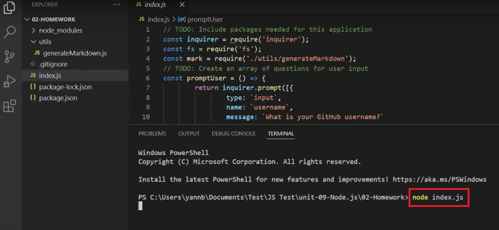

# README-Generator
 
## Description 
This is a command-line application that dynamically generates a professional README.md file from a user's input. Users can quickly and easily create a README file and devote more time to working on the project.
## Usage
Users can run the command to start creating the README.md file: 
`node index.js`
 

## Links

<a href="https://drive.google.com/file/d/1WqhvS9w_e-2rLs8aYcq4gtrfFvb-y5jd/view?usp=sharing">Link to the walkthrough video</a>

<a href="https://github.com/Yanbud/README-Generator">Link to the code repository</a>

## License
This project is licensed under the MIT license.
